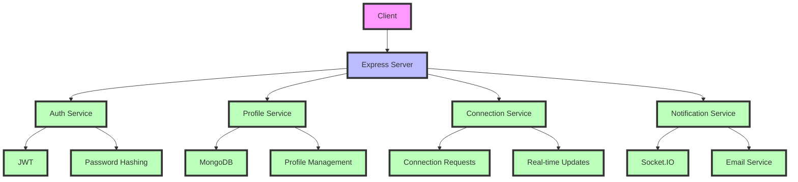

# DevTinder

A modern, real-time developer networking platform that connects developers based on their skills, interests, and projects. Inspired by Tinder, DevTinder makes it easy for developers to find and connect with like-minded professionals.

## 🚀 Features

- 🔐 Secure authentication and user profiles
- 🔍 Real-time connection requests and responses
- 🔄 Profile matching based on skills and interests
- 📱 Real-time notifications using Socket.IO
- 📊 User feed with relevant connections
- 🔄 Profile editing and password management
- 📧 Email notifications for important updates

## 📁 Project Structure

```
src/
├── config/          # Configuration files
├── controllers/     # API controllers
├── middleware/      # Express middleware
├── models/         # MongoDB models
├── routes/         # API routes
├── services/       # Business logic services
├── utils/          # Utility functions
└── app.js          # Main application file
```

## 📱 Architecture



### Architecture Overview

DevTinder follows a clean, modular architecture with clear separation of concerns:

1. **Client Layer**
   - Handles user interface and real-time updates
   - Communicates with Express Server via REST APIs
   - Uses Socket.IO for real-time features

2. **Express Server**
   - Central hub for all services
   - Handles API routing and business logic
   - Manages real-time communication

3. **Core Services**
   - **Authentication Service**: User authentication and authorization
   - **Profile Service**: User profiles and data management
   - **Connection Service**: Connection requests and matching
   - **Notification Service**: Real-time updates and email notifications

4. **Data Layer**
   - MongoDB: Stores user data, profiles, and connections
   - JWT: Handles authentication tokens
   - Socket.IO: Enables real-time communication
   - AWS SES: Handles email notifications

This architecture ensures scalability, maintainability, and real-time responsiveness while keeping the system modular and easy to extend.

### Architecture Overview

DevTinder follows a modular architecture with clear separation of concerns:

1. **Client Layer**
   - Handles user interface and real-time updates
   - Communicates with Express Server via REST APIs

2. **Express Server**
   - Central hub for all services
   - Handles API routing and business logic
   - Manages real-time communication

3. **Core Services**
   - **Authentication Service**: Handles user authentication and authorization
   - **Profile Service**: Manages user profiles and data
   - **Connection Service**: Handles connection requests and matching
   - **Notification Service**: Manages real-time updates and email notifications

4. **Data Layer**
   - MongoDB: Stores user data, profiles, and connections
   - JWT: Handles authentication tokens
   - Socket.IO: Enables real-time communication
   - AWS SES: Handles email notifications

This architecture ensures scalability, maintainability, and real-time responsiveness while keeping the system modular and easy to extend.

## 🛠️ Tech Stack

- **Backend**: Node.js with Express
- **Database**: MongoDB with Mongoose
- **Authentication**: JWT & Bcrypt
- **Real-time**: Socket.IO
- **Email**: AWS SES
- **Cron Jobs**: node-cron
- **Validation**: Validator
- **Date Handling**: date-fns
- **Environment**: dotenv

## 📦 Installation

1. Clone the repository
2. Install dependencies:
   ```bash
   npm install
   ```
3. Create a `.env` file with the following variables:
   ```
   MONGODB_URI=your_mongodb_uri
   JWT_SECRET=your_jwt_secret
   AWS_ACCESS_KEY_ID=your_aws_access_key
   AWS_SECRET_ACCESS_KEY=your_aws_secret_key
   ```
4. Start the development server:
   ```bash
   npm run dev
   ```

## 📖 API Documentation

For detailed API documentation including request/response formats, headers, and parameters, check our [API Documentation](API_LIST.md).

### API Endpoints Overview

- **Authentication**
  - POST `/auth/signup`
  - POST `/auth/login`
  - POST `/auth/logout`

- **Profile Management**
  - GET `/profile/view`
  - PATCH `/profile/edit`
  - PATCH `/profile/password`

- **Connections**
  - POST `/connections/request/send/:status/:userId`
  - POST `/connections/request/review/:status/:requestId`
  - GET `/user/connections`
  - GET `/user/requests/received`
  - GET `/user/feed`

## 📱 Real-time Features

- Real-time connection requests and responses
- Live updates to user feed
- Instant notifications for new connections
- Real-time status updates

## 🛡️ Security Features

- JWT-based authentication
- Bcrypt password hashing
- CORS protection
- Input validation
- Secure cookie handling
- Rate limiting

## 📝 License

ISC License

## 👤 Author

Yashpreet Bathla

---

DevTinder is a modern developer networking platform that brings the simplicity of Tinder to professional connections in the tech industry. Connect with developers who share your interests and skills in real-time.
